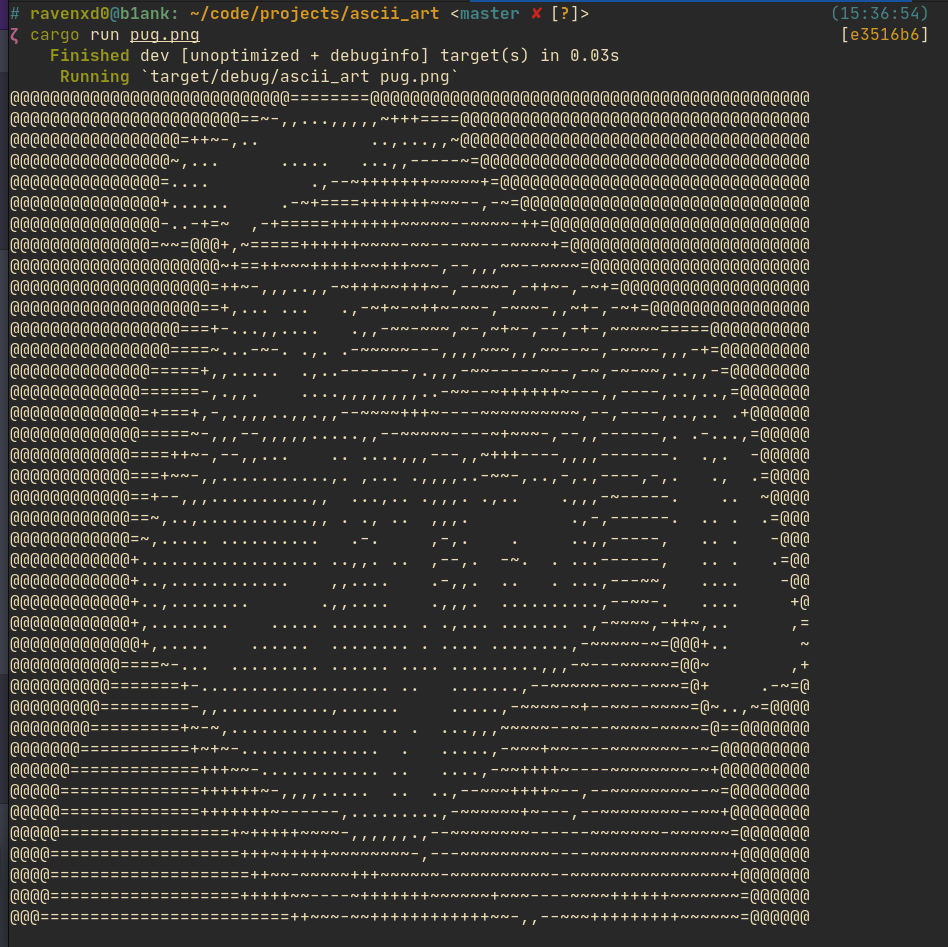
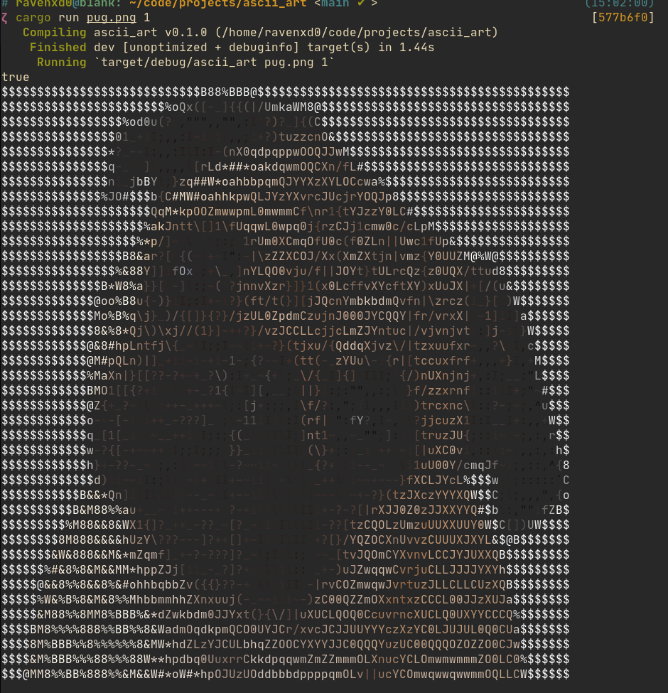

# ascii_art
ASCII Art Creation in Rust

[Image](https://github.com/image-rs/image) crate is used for Image processing.

This crate provides basic image processing functions and methods for converting to and from various image formats.

[Colored](https://github.com/mackwic/colored) For Coloring in terminal

Supports JPG/PNG.

Results:

    

    

